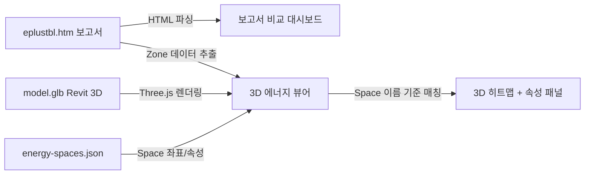
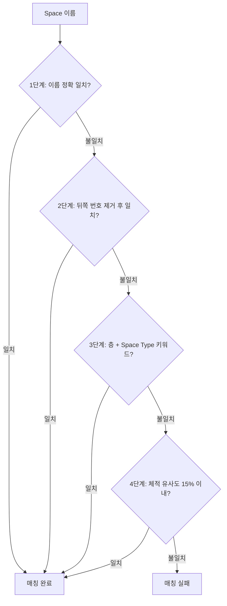

# Energy Report Viewer

EnergyPlus 에너지해석 보고서(HTM)를 웹 기반으로 시각화하는 도구이다.  
보고서 비교 대시보드와 3D 에너지 뷰어 두 가지로 구성되어 있으며, 브라우저에서 HTML 파일을 열기만 하면 별도 설치 없이 동작한다.

---

## 목차

1. [배경](#1-배경)
2. [보고서 비교 대시보드](#2-보고서-비교-대시보드)
3. [3D 에너지 뷰어](#3-3d-에너지-뷰어)
4. [Demo](#4-demo)
5. [실행 방법](#5-실행-방법)
6. [기술 스택](#6-기술-스택)
7. [Credits](#7-credits)

---

## 전체 요약

이 프로젝트는 EnergyPlus가 출력하는 HTML 보고서(eplustbl.htm)를 파싱하여 에너지 사용량, 월별 추이, Zone별 부하를 차트와 테이블로 시각화한다. 추가로 Revit에서 추출한 3D 모델(GLB)과 Space 데이터(JSON)를 결합하여, 에너지해석 보고서의 Zone 데이터를 3D 공간에 히트맵으로 매핑한다.

보고서 2개를 동시에 로드하면 설계안 간 에너지 변화를 항목별·공간별로 비교할 수 있다.

---

## 1. 배경

에너지해석 보고서는 PDF로 추출하면 데이터 활용이 어렵다. EnergyPlus가 **HTML 형식(eplustbl.htm)** 으로도 보고서를 출력한다는 것을 확인한 후, HTML을 파싱하여 각 보고서의 값을 읽어들이고 직관적으로 비교하는 웹 도구를 만들었다.

이후 예나님이 만든 Revit 3D 웹 뷰어를 기반으로, 에너지 해석 모델도 웹으로 추출이 가능하겠다고 판단했다. Revit MEP의 **Space** 기준으로 에너지해석 모델이 생성되고, 보고서에도 Space(Zone) 기준으로 상세 데이터가 나뉜다는 것을 확인하여, **Space 이름을 기준으로 3D 모델과 보고서 상세값을 매칭**하는 방식으로 구현했다.

---

## 2. 보고서 비교 대시보드

`index.html` — HTM 보고서를 드래그 앤 드롭하면 차트/테이블로 자동 시각화한다.

### 탭 구성

| 탭 | 기능 |
|----|------|
| **Overview** | End-Use 에너지 비율 (파이차트), 연료별 에너지 (막대), KPI 요약카드 |
| **Monthly Analysis** | 월별 에너지 소비 추이 — 적층 막대차트, 라인 차트, 데이터 테이블 |
| **Comparison** | 보고서 2개 비교 — 항목별 증감률 자동 계산, 비교 차트 |
| **Building Details** | 건물 정보, End Use 상세, Zone 요약, 쾌적 현황 |
| **Zone Explorer** | Zone별 면적/체적/부하 상세 조회 + Zone 간 비교 |
| **Insights** | 자동 분석 — 에너지 사용 패턴, 문제점 자동 도출 |
| **Developer API** | JSON/CSV 내보내기 (다른 도구 연동 가능) |

### 주요 특징

- HTM 파일 2개를 드롭하면 자동으로 비교 분석
- SI/IP 단위 실시간 전환
- 한국어/영어 UI 전환
- Chart.js 기반 인터랙티브 차트

---

## 3. 3D 에너지 뷰어

`energy-3d-viewer.html` — Revit 3D 모델 위에 에너지 데이터를 히트맵으로 시각화한다.

### 입력 파일

| 파일 | 설명 |
|------|------|
| `model.glb` | Revit에서 내보낸 3D 모델 |
| `energy-spaces.json` | Space 좌표, BBox, 면적, 체적, Analytical Surfaces |
| `eplustbl.htm` | EnergyPlus 에너지해석 보고서 (1~2개) |

### 핵심 기능

| 기능 | 설명 |
|------|------|
| **3D 모델 렌더링** | GLB를 Three.js로 렌더링 — 회전, 줌, 클릭 |
| **Space 3D 박스** | JSON의 BBox로 공간별 3D 박스 생성 |
| **해석 표면 표시** | Analytical Surface (벽/바닥/지붕/창) 경계면 표시 |
| **Zone 자동 매칭** | Space 이름 ↔ HTM Zone 이름을 4단계 전략으로 자동 매칭 |
| **히트맵 색상** | 면적, 체적, 조명밀도, 총부하, 냉방부하, 난방부하 기준 시각화 |
| **속성 패널** | 선택 공간의 치수, 에너지, 부하 등 Revit 스타일 상세 속성 |
| **보고서 비교** | HTM 2개 로드 시 공간별 변화량(증감률) 비교 |

### Zone 매칭 전략

Space 이름과 HTM Zone 이름을 자동으로 매칭한다. 4단계 전략을 순차적으로 시도한다.

---

## 4. Demo

### 데모 파일

`0212_DEMO_Energy3DViewer.html`을 브라우저에서 열면 파일 업로드 없이 바로 확인할 수 있다.

- 3층 오피스 빌딩 (13개 Space) + 에너지 데이터 내장
- 3D 뷰, Space 선택, 히트맵, 에너지 분석 요약, SI/IP 전환

### 데모 영상

**3D 뷰 조작 + 히트맵 색상 변경**  
3D 뷰 기본 조작(회전/줌)과 색상 기준(냉방부하, 층, 면적 등)에 따라 Space 색상이 히트맵으로 변하는 모습

https://github.com/user-attachments/assets/placeholder-video-1

**Space 클릭 → 에너지 보고서 매칭**  
각 Space를 클릭하면 에너지해석 보고서의 상세값(Zone 면적, 체적, 조명밀도, 냉난방 설계부하 등)이 해당 Space에 맞게 표시되는 모습

https://github.com/user-attachments/assets/placeholder-video-2

> 영상 링크는 GitHub에 업로드 후 실제 URL로 교체 예정

---

## 5. 실행 방법

### 보고서 비교 대시보드

1. `index.html`을 브라우저에서 연다 (더블클릭).
2. `eplustbl.htm` 파일을 드래그 앤 드롭한다.
3. 비교 분석을 하려면 HTM 파일을 하나 더 드롭한다.

### 3D 에너지 뷰어

1. `energy-3d-viewer.html`을 브라우저에서 연다 (더블클릭).
2. `model.glb` (Revit 3D 모델)을 드롭한다.
3. `energy-spaces.json` (Space 데이터)을 드롭한다.
4. `eplustbl.htm` (에너지 보고서)을 드롭한다. 비교 시 2개까지 가능.

### 데모

`0212_DEMO_Energy3DViewer.html`을 브라우저에서 열면 샘플 데이터로 바로 확인 가능.

> 별도 설치(서버, npm, Python 등)가 필요 없다. 브라우저에서 HTML 파일을 열기만 하면 동작한다.

---

## 6. 기술 스택

| 기술 | 용도 |
|------|------|
| HTML / CSS / JavaScript | 프론트엔드 전체 (단일 HTML 파일) |
| Three.js | 3D 렌더링 (WebGL, CDN importmap) |
| Chart.js | 차트 — 파이, 막대, 라인 (CDN) |

---

## 7. Credits

- **3D GLB Export / 웹 뷰어 기반 코드**: 예나님
- **보고서 파싱, 비교 대시보드, 3D 뷰어 확장**: 지형규
